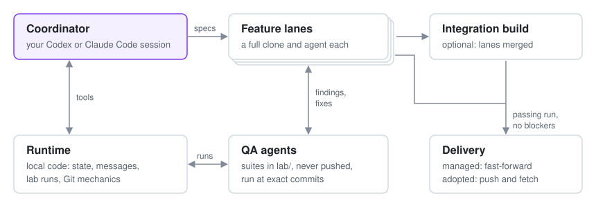

# OVERDRIVE

**Parallel feature work on one repository, run from a single Codex or Claude Code conversation.**

You describe the work to a coordinator. It writes a spec for each feature and gives each one its own clone and worker agent. QA agents build tests in a separate lab and send failures straight to the lane that owns them. A local runtime keeps the state, runs the tests and does the Git work, so the conversation stays about what to build and whether it is done.

<p align="center">
  
</p>

## Quick start

You need Node.js 24 or later, Git, and the Claude Code or Codex CLI. Clone the repository and register the checkout as a plugin marketplace:

```sh
git clone https://github.com/harrisonpedrero/overdrive.git
cd overdrive
```

Claude Code:

```sh
claude plugin marketplace add "$PWD"
claude plugin install overdrive@overdrive-local
```

Codex:

```sh
codex plugin marketplace add "$PWD"
codex plugin add overdrive@overdrive-local
```

`"$PWD"` works in PowerShell, bash and zsh, and the quotes keep a path with spaces in one piece.

Open the `workspace/` folder in a new Claude Code session or Codex task and say what you want:

> Use OVERDRIVE with https://github.com/acme/storefront.git. Add saved carts and faster product search as separate lanes, and have QA cover checkout and search in the browser.

Later in the same conversation:

> Build an integration of both lanes, have QA run everything against it, and tell me what stands between it and a pull request.

To start from nothing instead, describe the product; the coordinator creates it as a managed project in `project/`. The [operator guide](docs/operator-guide.md) covers updates, quieter permission prompts in Claude Code, and recovery.

## How it works

**Lanes and the lab.** A lane is one feature: a full clone on `feature/<slug>`, a durable spec and a worker agent. Lanes share no working tree, so agents don't trip over each other's half-finished edits. QA agents keep suites, harnesses and fixtures in `lab/`, a local Git repository beside the lanes that is never pushed, so a test can span several lanes and their integration without landing in a product commit.

**Evidence and messages.** `lab_run` executes a suite in a clean clone at an exact commit, with the lab pinned to a snapshot, and records the verdict, output and artifacts. Those records are the evidence; an agent saying the tests pass has sent a message, which is never recorded as a run. Agents message each other and the coordinator directly. A QA finding goes to the lane that owns it with how to reproduce it, and a passing rerun recorded after the fix can confirm it.

**Delivery.** A tested lane can be delivered on its own; when lanes need testing together, `integration_build` merges them into an integration clone first. For a project OVERDRIVE manages, `integrate` fast-forwards `project/` only to a commit with a passing lane or integration run at that exact commit and no open blocking findings. For a repository you adopted, it publishes nothing and returns push and fetch commands instead; the coordinator pushes or opens a pull request only when you ask.

Everything else is judgment. Nothing moves a lane through stages: the runtime enforces the few rules it can check exactly and leaves specs, priorities, reviews and delivery calls to the coordinator. That includes not splitting work, since a tightly coupled change usually goes better as one lane than as three that have to agree.

## Models

The coordinator is whatever model your session uses. Workers are configured separately, in the workspace's `overdrive.json`: the `harness` (`claude` when the workspace was initialized from Claude Code, otherwise `codex`), a workspace `model` and per-agent `laneModels`. Name a worker model in conversation and the coordinator records it there. Codex workers default to `gpt-6-sol`; Claude workers default to the Claude CLI's configured model. Every setting is in the [operator guide](docs/operator-guide.md#overdrivejson).

## Boundaries

Workers keep your MCP servers, connectors, skills and web tools. The runtime's permission policy denies:

- publishing, for every worker: `git push`, pull request and issue writes, releases, package publishes;
- OVERDRIVE's coordinator tools, for every worker;
- browser and computer control, for feature agents (QA agents keep it for UI testing);
- `git config --global` and `--system` writes, and file-tool writes outside the agent's own checkout (for QA, `lab/` and the integration clone) and the temp directory.

It is a capability boundary, not a sandbox. Shell commands run with your privileges and are not path-checked, and publishing is matched by command text, so a script that uploads something is not caught. On Claude Code the policy runs as a hook on every tool call; Claude Code still runs the call if the hook cannot start or times out, or if managed settings turn hooks off. On Codex it sees only escalations out of the `workspace-write` sandbox. [Architecture](docs/architecture.md#security-properties) has the details.

## Documentation

- [Operator guide](docs/operator-guide.md): installation details, configuration, the lab, integration and recovery.
- [Architecture](docs/architecture.md): storage, capability profiles, message delivery, and how runs, findings and integration work.
